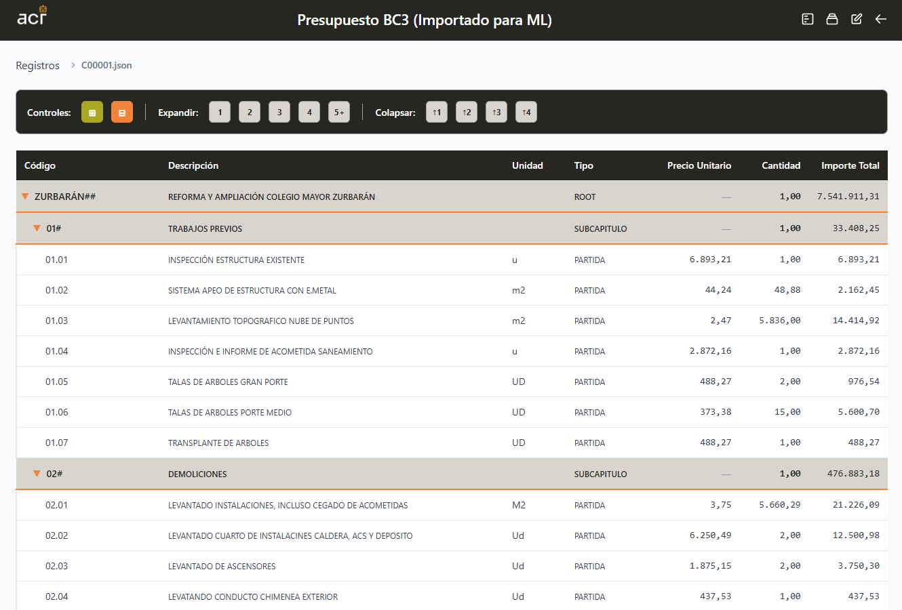
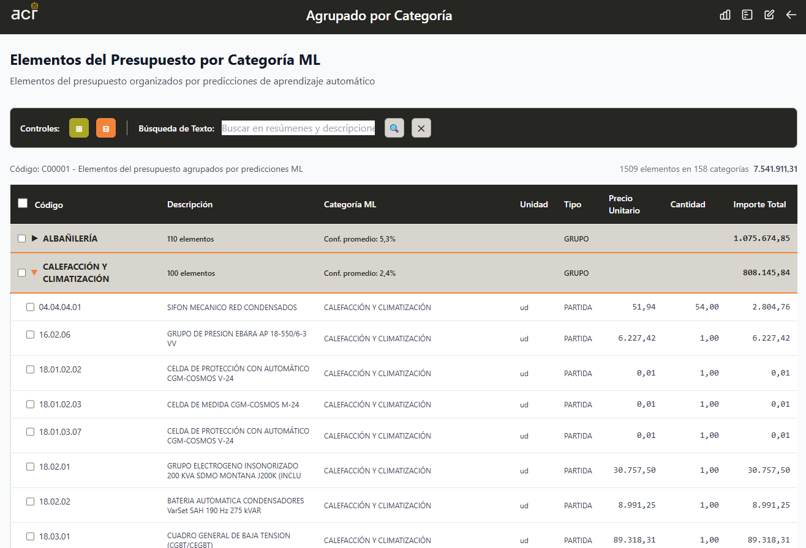

# BC3 File Processing and ML Classification System

This project provides a backend system for uploading, processing, and classifying BC3 construction project files using a machine learning model. It includes a FastAPI server for file handling and an ML classification service.

# Features

- Upload and convert BC3 files to JSON format
- Maintain a registry of uploaded files with metadata
- Classify text nodes in the JSON using a pre-trained ML model
- Serve a simple web frontend to edit classifications for retraining

## Screenshots





## Quick Start

**Start Main Backend (File Processing):**
```bash
poetry run backend
# or
poetry run start
# or
poetry run python -m backend.main
```
Server runs on `http://localhost:8005`

**Install Dependencies:**
```bash
poetry install
```

## Architecture Overview

This is a dual-backend file processing and ML classification system:

- **Main Backend** (`backend/main.py`): FastAPI server for BC3 file upload, conversion, ML categorizer, and management
- **Frontend** (`frontend/`): Static HTML/JS/CSS interface
- **Tools** (`tools/`): BC3 file converter and processing utilities

### Key Components

**File Processing Workflow:**
1. Upload .bc3 files via `/uploadfile/` with metadata (project_name, localization, email, year)
2. Files are assigned sequential codes (C00001, C00002, etc.)
3. BC3 files converted to JSON using `tools/bc3_converter.py`
4. Registry maintained in `data/uploads/records.json`

**ML Classification Workflow:**
1. Post-process converted JSON files via `/records/{code}/ml`
2. PARTIDA nodes get ML predictions using Joblib pipeline
3. Results stored in `data/categorized/` directory with `_prediction` objects
4. Supports manual labeling via `/records/{code}/label`

### Directory Structure
- `data/uploads/` - Original .bc3 files and registry
- `data/processed/` - Converted JSON files
- `data/categorized/` - ML-enriched JSON files
- `data/models/` - ML model artifacts
- `frontend/` - Static web interface
- `tools/` - BC3 conversion utilities

## Key Configuration

**Allowed Localizations:**
- NAVARRA, PAIS VASCO, ZARAGOZA, CASTILLA Y LEON, MADRID

**ML Model Path:**
Set `ML_JOBLIB_MODEL` environment variable (default: `../data/models/linear_ovr_tfidf.joblib`)

## API Documentation

### Main Backend (Port 8005)

#### Upload File
**POST** `/uploadfile/?name={name}`
- Upload and process files (especially .bc3 files)
- **Parameters**: `name` (query parameter) - Name for the processed file
- **Body**: `multipart/form-data` with file upload
- **Response**: JSON with processing status

#### List Files
**GET** `/files/`
- List all uploaded and processed files
- **Response**: 
```json
{
  "uploaded_files": ["file1.bc3", "file2.txt"],
  "processed_files": ["file1.json", "file2.json"]
}
```

#### Serve Frontend
**GET** `/` - Serves main HTML interface
**GET** `/calc.html` - Serves calculator interface

### ML Backend (Port 8001)

#### Health Check
**GET** `/`
- Check server status and model loading state
- **Response**:
```json
{
  "status": "ok",
  "model_loaded": true,
  "model_path": "/path/to/model_bundle.pkl"
}
```

#### Text Classification
**POST** `/predict`
- Classify Spanish text using the loaded ML model
- **Request Body**:
```json
{
  "text": "Main text to classify",
  "descriptive": "Optional additional descriptive text"
}
```
- **Response**:
```json
{
  "label": "predicted_category"
}
```
- **Error Responses**:
  - `503`: Model not loaded
  - `500`: Prediction failed

#### Example Usage
```bash
# Health check
curl http://localhost:8001/

# Text prediction
curl -X POST http://localhost:8001/predict \
  -H "Content-Type: application/json" \
  -d '{"text": "Texto en español para clasificar", "descriptive": "descripción adicional"}'
```
## ML Categorization Workflow

This project supports a second processing step where a text classification model enriches the converted JSON with predictions. The result is stored separately and the record is marked as processed by ML.

- Upload step:
  - Upload a `.bc3` file via `/upload.html` with required metadata.
  - The backend converts it to JSON using `tools/bc3_converter.py` and stores it under `processed/Cxxxxx.json`.
  - A registry entry is stored in `uploads/records.json` including metadata and `ml_processed: false` initially.

- ML step:
  - Trigger per file from the main page using the “Process ML” button, or via API: `POST /records/{code}/ml`.
  - The backend loads a Joblib pipeline and traverses the processed JSON. For nodes with `concept_type == "PARTIDA"`, it calls the classifier (optionally with `descriptive_text`) and inserts a `_prediction` object:
    ```json
    {
      "predicted_label": "...",
      "predicted_proba": 0.93,
      "topk_labels": ["...", "..."],
      "topk_probas": [0.93, 0.04, 0.03]
    }
    ```
  - The enriched JSON is saved under `categorized/Cxxxxx.json`.
  - The registry updates to set `ml_processed: true`, `ml_processed_at`, and `categorized_filename`.
  - You can re-run ML any time via the “Reprocess” button or `POST /records/{code}/ml`.

- Predict endpoint:
  - `POST /predict` body: `{ "text": string, "descriptive"?: string, "topk"?: number }`.
  - Response includes the top-1 label/probability and top-k lists as shown above.

- Model status endpoint:
  - `GET /ml/status` returns `{ model_path, loaded, error? }` and attempts a lazy load of the model.

- Configuring the model:
  - Set env var `ML_JOBLIB_MODEL` to point to your Joblib pipeline (e.g. TF–IDF + Linear SVM/LogReg). Default path is `../data/models/linear_ovr_tfidf.joblib`.

- Folders used:
  - `uploads/` original uploads and `uploads/records.json` registry
  - `processed/` converted JSON from `.bc3`
  - `categorized/` ML-enriched JSON

### Example API calls

- Run ML for a file with code `C00001`:

```bash
curl -X POST http://localhost:8005/records/C00001/ml
```

- Use the predict endpoint directly:

```bash
curl -X POST http://localhost:8005/predict \
  -H 'Content-Type: application/json' \
  -d '{"text": "Hormigón HA-25 en zapata...", "topk": 3}'
```

- Check model status:

```bash
curl http://localhost:8005/ml/status
```

### CLI helpers (optional)

See `temp/predict_linear.py` for a standalone prediction script using a Joblib model, and `temp/json_ml_cat.py` as a reference for walking a JSON and calling a predict endpoint.
